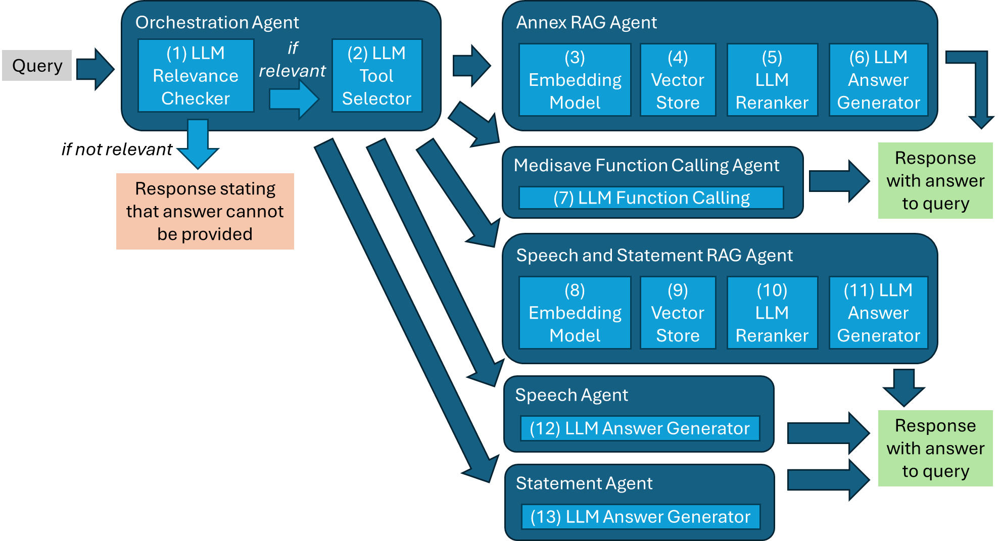
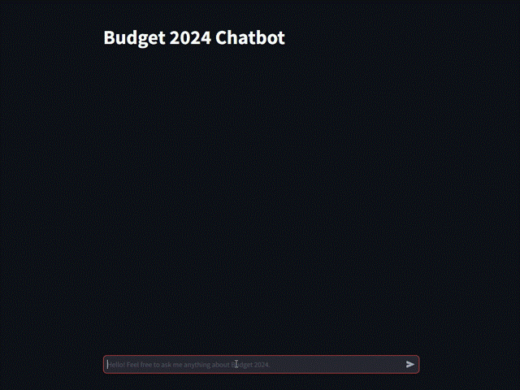

# Budget 2024 Chatbot
This code repository is about developing an LLM chatbot using ChatGPT for Singapore’s Finance Minister’s Budget 2024. The code is based on the **LlamaIndex** framework and uses **Streamlit** as the web app framework. The OpenAI LLM used is **gpt-4o-mini** and the OpenAI text embedding model used is **text-embedding-3-small**. The codes also include **Dockerisation** instructions.

Further details and elaboration can be found in `Explanation.pdf`. An overall architecture diagram of various chatbot components can be seen below.




## Pre-requisites
**Python via Miniconda**
- Install [Miniconda](https://docs.anaconda.com/free/miniconda/index.html).
- Create a new `Python 3.11` environment via [Conda](https://towardsdatascience.com/a-guide-to-conda-environments-bc6180fc533) by running the following command that creates an environment and installs Python packages via `pip`.
  ```bash
  conda env create -f ./conda-env.yml
  ```

  If there are subsequent changes to the pip requirements, the following command can be used to update the environment.
  ```bash
  conda env update -f ./conda-env.yml
  ```
  - Create `.env` file based on the given `.env-template` file. Fill the `OPENAI_API_KEY` value with your own OpenAI key.

**Docker**
- Set up Docker on your local environment. (e.g. [Rancher Desktop](https://docs.rancherdesktop.io/getting-started/installation/))
- Docker is needed wrap the various applications into Docker images and run the Docker images as containers.

## Running The Codes Locally

The Streamlit app can be run via the following command in the conda environment:
```bash
  streamlit run app.py
```
The Streamlit app can be seen in the browser at `localhost:8501`. The web app should like the screenshot gif below. The responses returned to your queries should have the streaming text effect as seen below.



## Docker Scripts

The Docker commands are wrapped within `.bat` files for your convenience to build the Docker image and run the Docker containers. These `.bat` files can be run a Windows environment. For a Linux environment, the same Docker commands found in the `.bat` files can also be used.

- docker_build.bat

  This script is for building a Docker image for the Streamlit app. To use this script, run the following command with a specified tag number.
  ```bash
  docker_build.bat <version no.>
  #e.g. docker_build.bat 0.0.1
  ```
  This script saves a Docker image on the local registry.
- docker_run.bat

  This script runs the earlier created Docker image from the local Docker registry as a Docker container on the local machine. The container name for the created container is `budget-rag`. To use this script, run the following command with a specified tag number.
  ```bash
  docker_run.bat <version no.>
  #e.g. docker_run.bat 0.0.1
  ```
  The Streamlit web app can then be viewed on the browser at `localhost:8501`.

- docker_stop.bat

  This script stops the container created from the earlier run script. To use this script, run the following command.
  ```bash
    docker_stop.bat
  ```
  No tag number is needed as compared to the other scripts because the container is stopped based on the container name of `budget-rag`.
